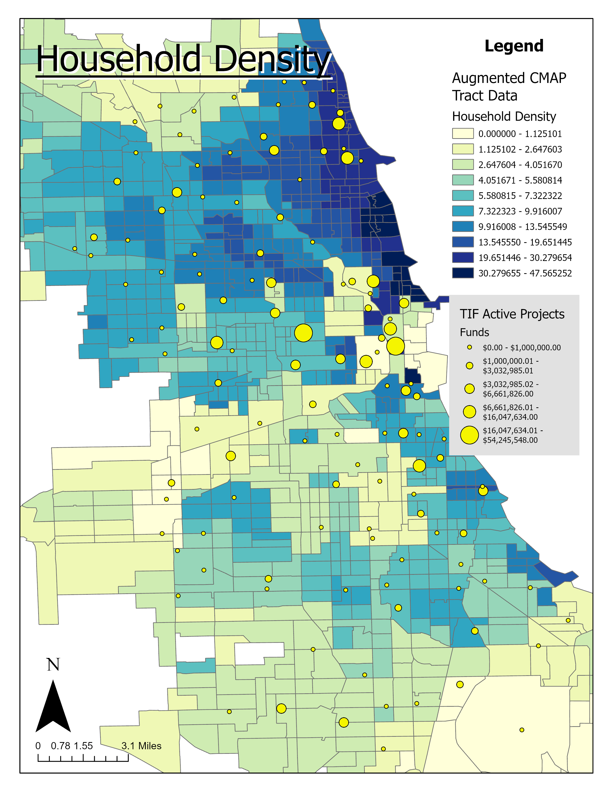

```{r setup, include=FALSE}
knitr::opts_chunk$set(echo = FALSE, warning = FALSE, message = FALSE)
library(knitr)
library(tidyverse)
library(lubridate)
library(tidymodels)
library(sf)
library(tigris)
library(tidycensus)
library(janitor)
library(factoextra)
library(cluster)
library(kernlab)
library(dbscan)
library(ggExtra)
library(corrgram)
library(kableExtra)
library(magrittr)
```

```{r}
chicago_tracts = read_csv("chicago_tracts.csv") %>%
  mutate(GEOID = as.character(GEOID))
```

```{r}
chicago_tracts_transit =
  read_csv("chicago_tracts_2020_transit_needs_2015_2017_walkability_2020_tif_2021.csv") %>%
  mutate(
    GEOID = as.character(GEOID),
    tract = NAME,
    tif = ref,
    walk_score = TotalScore,
    trans_avail = Mean_trans
  )

tif_exp = read_csv("TIF_Expenditures_2017_2020.csv") %>%
  clean_names() %>%
  rowwise() %>%
  mutate(total_tif_expend = sum(c_across(8:22))) %>%
  group_by(tif_number) %>%
  summarise(total_tif_expend_2017_2020 = sum(total_tif_expend)) %>%
  ungroup()

chicago_tracts_transit_tif =
 chicago_tracts_transit %>% 
  left_join(
    tif_exp,
    by = c("tif"="tif_number"),
    suffix = c("","_tif")
  ) %>%
  mutate(lat = INTPTLAT,
         lon = INTPTLON) %>%
  group_by(GEOID,
           tract,
           Emp_Transi,
           HH_Density,
           lat,
           lon) %>%
  summarise(
    HH_per_acr_med = median(HH_per_acr, na.rm = T),
    emp_mile_med = median(Emp_within, na.rm = T),
    trans_avail_med = median(trans_avail, na.rm = T),
    walk_score_med = median(walk_score, na.rm = T),
    tif_expend_med = median(total_tif_expend_2017_2020, na.rm = T)
  ) %>%
  ungroup()
```

# Introduction

## Tax Increment Financing

Tax Increment Financing districts are a funding tool to “build and repair roads and infrastructure, clean polluted land and put vacant properties back to productive use, usually in conjunction with private development projects”.

Funds are generated by the increase in property value properties in the designated areas. The property taxes generated off of any growth after the area designation are then used t fund projects. In other words, it comes only from the difference in property value after designation.

The areas themselves must be areas characterized by blight which means areas that potentially have excessive vacancies, lack of physical maintenance, lack of community planning, dilapidation, etc. That is how they _supposed_ to work.

```{r}
# vars = load_variables(2020, "acs5", cache = TRUE)
# subject_vars = load_variables(2020, "acs5/subject", cache = TRUE)
```

## Data Variable and Variable Characteristics

```{r echo=FALSE, results='hide', eval=FALSE}
cook_fin_acs = 
  get_acs(
    geography = "tract",
    # table = "S2503",
    year = 2020,
    variables = c(
      household_income = "B25120_001",
      mean_commute_minutes = "S0802_C04_090"
    ),
    state = 17,
    county = 31,
    output = 'wide',
    geometry = T,
    cache_table = T
  )

# st_write(cook_fin_acs, "cook_fin_acs.shp", append=FALSE)
write_csv(cook_fin_acs, "cook_fin_acs.csv")

cook_acs = get_acs(
  geography = "tract",
  year = 2020,
  variables = c(
    transit_means_tot = "B08119_001",
    transit_public = "B08119_028",
    transit_walked = "B08119_037",
    prop_value_med = "B25097_001"
  ), 
  state = 17,
  county = 31,
  # place = "Chicago city",
  output = 'wide',
  geometry = T,
  cache_table = T
)

# st_write(cook_acs, "cook_acs.shp", append=FALSE)
write_csv(cook_acs, "cook_acs.csv")
```

```{r echo=FALSE, results='hide'}
# cook_fin_acs = st_read("cook_fin_acs.shp")
# cook_acs = st_read("cook_acs.shp")
cook_fin_acs =
  read_csv("cook_fin_acs.csv") %>%
  mutate(GEOID = as.character(GEOID))
cook_acs =
  read_csv("cook_acs.csv") %>%
  mutate(GEOID = as.character(GEOID))
```


```{r}
chicago_transit_acs_tif =
  chicago_tracts_transit_tif %>%
  left_join(cook_acs,
            by = c("GEOID" = "GEOID"),
            suffix = c("", "_acs")) %>%
  left_join(cook_fin_acs,
            by = c("GEOID" = "GEOID"),
            suffix = c("", "_fin_acs")) %>%
  select(c("GEOID":"tif_expend_med"),
        c("transit_means_totE":"prop_value_medM"),
        c("household_incomeE":"mean_commute_minutesM"),
        "geometry",
        "lat",
        "lon")
```

The census data used includes income data, mean commute time in minutes and property value. All census data is aggregated by tract, which was the basis of all joins used for the final processed input data. CMAP data used includes metrics on transit Accessibility, household density and employment accessibility. Finally, from the Chicago Data Portal, the boundaries for TIFs and TIF expenditures were obtained. All of this data was combined using spatial joins and joins by census tract ID wherever possible. 

```{r}
p <-
  ggplot(
    chicago_transit_acs_tif,
    aes(x = transit_means_totE, y = prop_value_medE, size = emp_mile_med)
  ) +
  geom_point() +
  theme(legend.position="none") +
  labs(title = "Property Value by Time Spent on Transit to Work",
       subtitle = "Dot size represents employment accessibility")

# with marginal histogram
p1 <- ggMarginal(p, type = "histogram") 

p1
```

When we look at the transit accessibility versus propoerty value, we find a light correlation between indicating that those areas with higher property values tend to have more access to transit means, and to some degree, more employment.

```{r echo=F, message=F, fig.width=8, fig.height=6}
corr = corrgram(
  chicago_transit_acs_tif %>% select(c(7:10),c(11, 18, 20)),
  order = TRUE,
  lower.panel = panel.ellipse,
  upper.panel = panel.shade,
  text.panel = panel.txt,
  diag.panel = panel.minmax,
  main = "Correlations"
)
corr
```

We see some similar correlations with property value, walkability and TIF expenditure.

```{r}
econ_zone_recipe = 
  recipe(~., data = chicago_transit_acs_tif %>% select(1, 5:23)) %>% 
  step_impute_knn(all_numeric(), neighbors = 3) %>%
  step_normalize(all_numeric(), na_rm = T) %>%
  prep()
econ_zone_baked = econ_zone_recipe %>% bake(new_data = NULL)
econ_zone_matrix = econ_zone_baked %>% select(c("lat":"mean_commute_minutesM"))
```

## K-Means Clustering

```{r}
points = econ_zone_matrix
```

```{r K-Means Clustering}
kclusts =
  tibble(k = 1:9) %>%
  mutate(
    kclust = map(k, ~kmeans(points, .x)),
    tidied = map(kclust, tidy),
    glanced = map(kclust, glance),
    augmented = map(kclust, augment, points)
  )

clusters =
  kclusts %>%
  unnest(cols = c(tidied))

assignments =
  kclusts %>% 
  unnest(cols = c(augmented))

clusterings =
  kclusts %>%
  unnest(cols = c(glanced))
```

```{r}
fviz_nbclust(econ_zone_matrix, FUN = kmeans, method = "wss")
```


```{r}
fviz_nbclust(econ_zone_matrix, FUN = kmeans, method = "silhouette")
```

```{r}
chicago_transit_acs_tif_aug =
  chicago_transit_acs_tif %>%
  mutate(means_2 = kmeans(points, centers = 2)$cluster,
         means_3 = kmeans(points, centers = 3)$cluster) %>%
  mutate(
    km_label_1 = case_when(means_2 == 1 ~ "High Development",
                           means_2 == 2 ~ "Low Development"),
    km_label_2 = case_when(
      means_3 == 1 ~ "Low Development",
      means_3 == 3 ~ "Medium Development",
      means_3 == 2 ~ "High Development"
    )
  )

transit_aug_table =
  chicago_transit_acs_tif_aug %>%
  group_by(km_label_2) %>%
  summarise(hh_income = median(household_incomeE, na.rm = T),
            prop_value = median(prop_value_medE, na.rm = T),
            transit_avail = median(trans_avail_med, na.rm = T),
            walkability = median(walk_score_med, na.rm = T)) %>%
  arrange(hh_income)

transit_aug_kable = kable(transit_aug_table, "html") %>%
  kable_styling("striped")

# transit_aug_kable %>% save_kable("transit_zone_metrics.png")

transit_aug_kable
```

```{r}
write_csv(chicago_transit_acs_tif_aug, file = "chicago_transit_acs_tif_aug.csv")
```

```{r}
econ_means = kmeans(points, centers = 3)

fviz_cluster(econ_means, 
             data = points,
             geom = "point")
```


```{r}
fviz_cluster(econ_means, 
             data = points %>% select(lat, lon),
             geom="point")
```

```{r}
fviz_cluster(econ_means, 
             data = points %>% select(household_incomeE, tif_expend_med),
             geom="point")
```

## Kernal K-Means Clustering

```{r eval=FALSE}
tibble(k = list(1:9)) %>%
  mutate(
    kkclust = map(
      k,
      ~ kkmeans(
        x = as.matrix(points),
        centers = .x,
        kernel = 'rbfdot',
        kpar = "automatic"
      )
    )
  )
     
```

```{r Kernal K-Means Clustering}
kkclusts =
  tibble::tibble(k = 1:9) %>%
  mutate(
    kkclust = map(
      k,
      ~ kkmeans(
        x = as.matrix(points),
        centers = .x,
        kernel = 'rbfdot',
        kpar = list(sigma = 0.005)
      )
    ),
    centers = map(kkclust, centers),
    withinssq = map(kkclust, withinss),
    size = map(kkclust, size),
    ssq = map2(withinssq, size, ~ .x/.y),
    tssq = map(ssq, sum)
  )

clusters = 
  kkclusts %>%
  unnest(cols = c(centers))

clusterings =
  kkclusts %>%
  unnest(cols = c(withinssq))
```

```{r}
econ_kkmeans = kkmeans(
  as.matrix(points),
  centers = 3,
  kernel = 'rbfdot',
  kpar = list(sigma = 0.005)
)
```

```{r}
chicago_transit_acs_tif_aug_kkm =
  chicago_transit_acs_tif %>%
  mutate(
    kkmeans_3 = econ_kkmeans@.Data,
    kkm_label = case_when(
      kkmeans_3 == 1 ~ "Low Development",
      kkmeans_3 == 3 ~ "Medium Development",
      kkmeans_3 == 2 ~ "High Development"
    )
  ) 

chicago_transit_acs_tif_aug_kkm%>% 
  group_by(kkm_label) %>%
  summarise(hh_income = median(household_incomeE, na.rm = T),
            prop_value = median(prop_value_medE, na.rm = T),
            transit_avail = median(trans_avail_med, na.rm = T),
            walkability = median(walk_score_med, na.rm = T)) %>%
  arrange(hh_income)
```

```{r}
fviz_cluster(list(data = points, cluster = econ_kkmeans@.Data),
             geom = "point",
             main = "3-means Clustering",
             subtitle = "Displayed using PCA") 
```

```{r}
fviz_cluster(list(data = points %>% select(lat, lon), 
                  cluster = econ_kkmeans@.Data),
             geom = "point",
             main = "3-means Clustering",
             subtitle = "Mapped onto Lattitude/Longitude") 
```

## DBSCAN

```{r}
kNNdistplot(points, k=4)
```

```{r}
db = dbscan(econ_zone_matrix, eps = 2.75, minPts = 4)
```

```{r}
chicago_transit_acs_tif_aug_db =
  chicago_transit_acs_tif %>%
  mutate(dbmeans_3 = db$cluster,
         db_label = case_when(
          dbmeans_3 == 0 ~ "Excluded",
          dbmeans_3 == 1 ~ "Low Development",
          dbmeans_3 == 3 ~ "Medium Development",
          dbmeans_3 == 2 ~ "High Development"
        )) 
    
chicago_transit_acs_tif_aug_db %>%
  group_by(db_label) %>%
  summarise(hh_income = median(household_incomeE, na.rm = T),
            prop_value = median(prop_value_medE, na.rm = T),
            transit_avail = median(trans_avail_med, na.rm = T),
            walkability = median(walk_score_med, na.rm = T)) %>%
  arrange(hh_income)
```

```{r}
fviz_cluster(
  db,
  data = econ_zone_matrix,
  geom = "point",
  ellipse = T,
  main = "DBSCAN eps = 2.75, minPts = 4",
  subtitle = "PCA Projection"
)
```

```{r}
fviz_cluster(
  db,
  data = econ_zone_matrix %>% select(lat, lon),
  geom = "point",
  ellipse = T,
  main = "DBSCAN eps = 2.75, minPts = 4",
  subtitle = "Latitude/Longitude"
)
```

## GIS Visualizations

```{r}
# st_write(chicago_transit_acs_tif_aug, "chicago_transit_acs_tif_aug.geojson")
```

```{r}
tif_projects = read_csv("Tax_Increment_Financing__TIF__Annual_Report_-_Projects.csv")
# tif_projects_agg = 
#   tif_projects %>%
#   clean_names() %>%
#   filter(ongoing == T) %>%
#   group_by(tif_number) %>%
#   summarise(total_payments = sum(current_year_payments))
# write_csv(tif_projects_agg, file = "tif_projects_agg.csv")
```

```{r}
cluster_spend = read_csv("EconomicClustering_TIF_Projects.csv")
```

```{r}
knitr::include_graphics("Clustering Layout.jpg")
```

```{r}

```

# Additional Statistical Tests

```{r}
table(chicago_transit_acs_tif_aug$km_label_2)
```


```{r}
prop.test(
  x = 440,
  n = length(chicago_transit_acs_tif_aug$km_label_2),
  p = 1/3,
  alternative = "less"
)
```


# Conclusion

Although there aren't any easy metrics to compare across models, the usual k-means clustering appears to work best for a couple reasons. Firstly, it produces, visually anyway, the best separation between clusters. Secondly, it provides better coverage of the points whereas density based methods often exclude large chunks of data. Regardless, all of the models produced fairly sensible results in terms of the aggregate statistics of the groups associated with each label in each model.

TIF district based economic policy tends to have a lot of supply side economics to it. Therefore no matter how one tries to optimize the immediate benefits of the policy will be on those who have the ability to participate in development and the decisions thereof, in other words, land owners, shareholders, corporate managers, etc. On the technical side of things, there are plenty of ways to change the hypothesis space or the model that determines the economic zones. The choice of variables can be chosen to reflect more of industrial supply side of economic, like the value of exports from an area, as opposed to more consumer or residential related statistics.